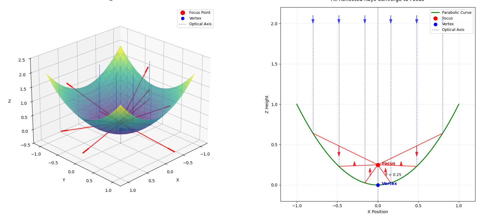
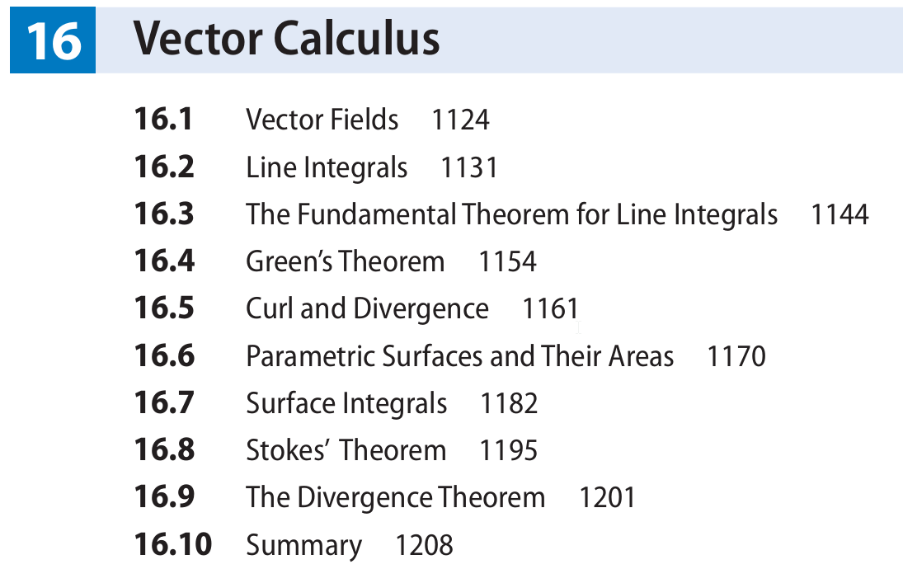

## hello math 





---

[upenn.edu  Math 114 chapt16 Vector Fields 16.2 Line Integrals slides](https://www2.math.upenn.edu/~wziller/math114f13/notes.html)


```latex
\iint\limits_{R} f(x,y) \, dA = 
\int_{a}^{b} \left( \int_{c}^{d} f(x,y) \, dy \right) dx =
\int_{c}^{d} \left( \int_{a}^{b} f(x,y) \, dx \right) dy
```


---

## chapter 16

